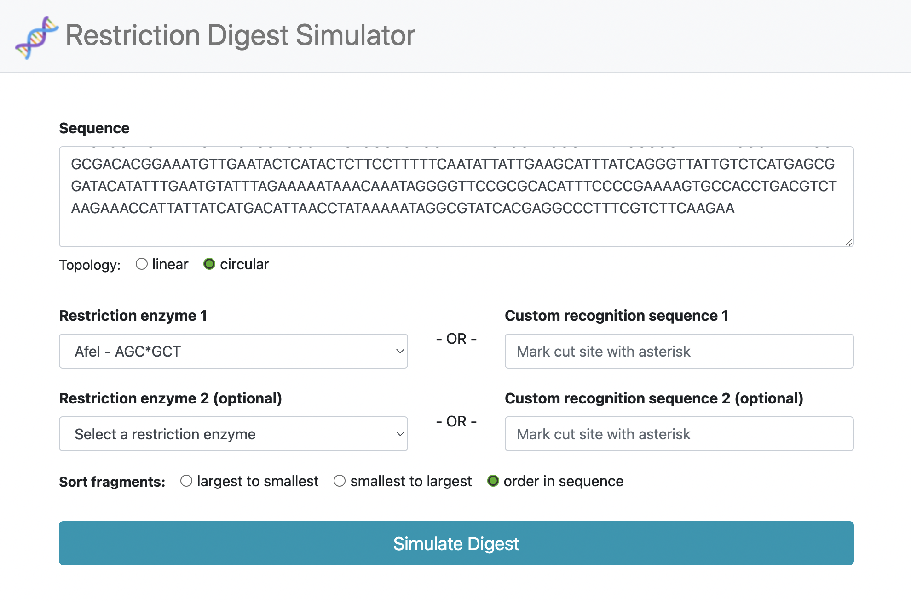
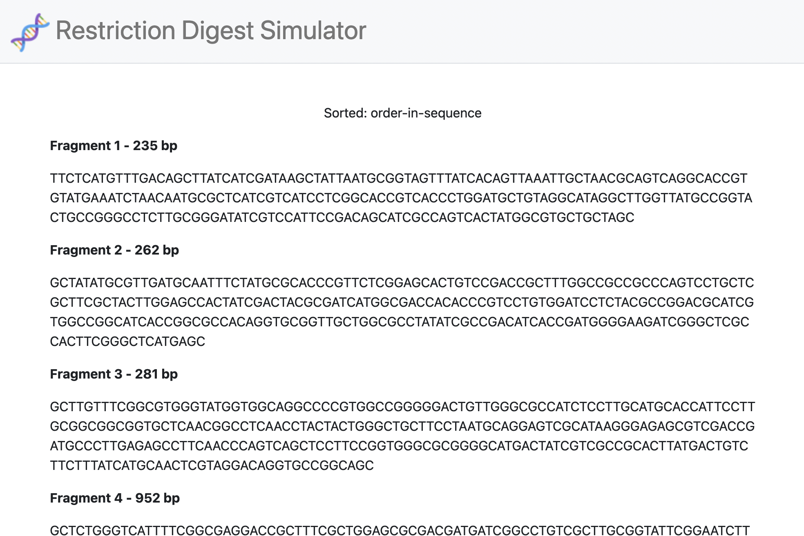

# Restriction Digest Simulator
Web application to simulate fragments produced when DNA is digested with given restriction enzymes.

## Installation
Ensure that the Python modules specified in `requirements.txt` are installed. Then run `flask run` in the project directory and open output URL in a browser.

## Usage
Specify the DNA sequence, the DNA topology, one or two restriction enzymes, and the order to sort the fragments, then click "Simulate Digest:"

A page will be loaded with the produced fragments:

